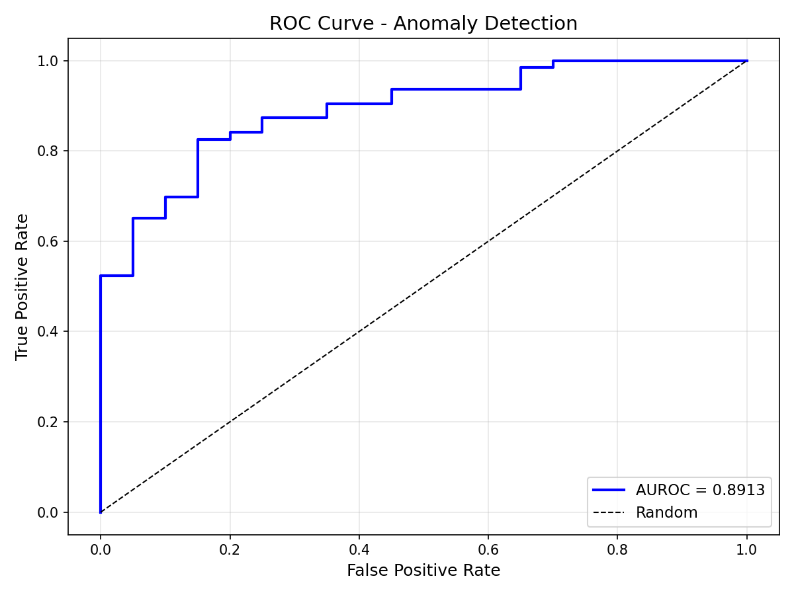

# Anomaly Detection in Industrial Images and Video
**Developed by Kuldeep Choksi**

A comprehensive deep learning system for detecting manufacturing defects in both static images and video sequences. Uses convolutional autoencoders for images and ConvLSTM temporal modeling for video analysis.


## Features

- **Image Anomaly Detection** - Detect defects in single images
- **Video Anomaly Detection** - Detect temporal anomalies in video sequences
- **Interactive UI** - Web-based interface for training and inference
- **Custom Dataset Support** - Use your own images or videos
- **Side-by-Side Video Output** - Original | Reconstruction | Heatmap visualization

## Results

### Image Detection (MVTec Bottle)
**AUROC: 0.8913**

| Defect Type | Samples | Mean Anomaly Score |
|-------------|---------|-------------------|
| good (normal) | 20 | 0.0032 |
| broken_large | 20 | 0.0048 |
| broken_small | 22 | 0.0054 |
| contamination | 21 | 0.0049 |



---

## Quick Start

### Installation

```bash
git clone https://github.com/KuldeepChoksi/video-anomaly-detection.git
cd video-anomaly-detection
pip install -r requirements.txt
```

### Launch the UI

```bash
python main.py
```

Open http://localhost:7860 in your browser.

---

## Image Anomaly Detection

### How It Works

1. Train an autoencoder on ONLY normal (defect-free) images
2. The model learns to reconstruct normal patterns
3. When shown a defective image, reconstruction fails
4. High reconstruction error = anomaly detected

### Using Your Own Images

Create this folder structure:

```
data/
    your_product/
        train/
            good/
                image001.png
                image002.png
                ... (100+ normal images recommended)
        test/
            good/
                normal_test_001.png
            defect_type_1/
                defect_001.png
            defect_type_2/
                defect_002.png
```

Then train:
```bash
python train.py --category your_product --data-dir ./data --epochs 50
```

---

## Video Anomaly Detection

### How It Works

1. Train a ConvLSTM autoencoder on normal operation videos
2. The model learns temporal patterns (what normal motion/change looks like)
3. When shown anomalous sequences, reconstruction fails
4. Frame-by-frame anomaly scores identify exactly when anomalies occur

### Critical Concept: Training Data Defines "Normal"

**This is the most important thing to understand:**

The model learns what "normal" looks like ONLY from your training data. Anything different from training data will be flagged as anomalous.

| Training Data Contains | Model Will Flag As Anomaly |
|------------------------|---------------------------|
| Only perfect operation | ANY deviation from perfect |
| Perfect + some minor issues | Only major issues |
| Mix of good and bad | Nothing (confused model) |

**Best Practice:** Train EXCLUSIVELY on perfect, defect-free operation. Be strict about this. Review every training video to ensure zero anomalies are present.

### What Can Be Detected

**Detectable Anomalies:**
- Sudden visual changes (breaking, snapping, stopping)
- Appearance changes (color shifts, deformation, foreign objects, bubbles)
- Motion anomalies (unexpected movement, jerking, vibration)
- Equipment malfunctions visible on camera
- Process deviations with visible indicators

**Speed Anomaly Detection - Important Note:**

Speed changes can ONLY be detected when there is visible motion in the frame:

| Scenario | Speed Detection | Why |
|----------|-----------------|-----|
| Object moving across frame (conveyor belt, rolling item) | Yes | Model sees pixel motion between frames |
| Object entering/exiting frame | Yes | Visible movement to track |
| Static scene with process happening inside (e.g., zoomed-in growth, reaction chamber) | No | No pixel motion to compare |
| Static scene WITH visual markers moving through | Yes | Markers provide motion reference |

If your process appears visually static (e.g., high-zoom microscopy, fixed reaction zones), the model cannot detect speed changes without added visual reference markers.

**Detection Behavior for Sustained Anomalies:**

If an anomaly lasts several seconds (e.g., 3 seconds at 60fps = 180 frames):
- Frame where anomaly STARTS: High score spike (transition detected)
- Frames during anomaly: Elevated scores (different from training data)
- Frame where anomaly ENDS: Another spike (transition back to normal)

The model detects both the transitions AND the sustained difference from normal. It will NOT "normalize" a long-lasting anomaly if that anomaly pattern was never in training data.

**Limitations:**
- Cannot detect internal/invisible defects
- Cannot detect anomalies outside camera view
- Cannot detect speed changes in visually static scenes (see note above)
- Requires sufficient normal training data
- Detection quality depends entirely on training data quality
- Very subtle anomalies may not be detected if not visually distinguishable

### Using Your Own Videos

#### Recording Guidelines

| Requirement | Recommendation |
|-------------|----------------|
| **Camera Position** | Fixed, stable mount - no shaking or panning |
| **Lighting** | Consistent throughout recording - avoid flickering or moving shadows |
| **Framing** | Keep subject in same position across all videos |
| **Resolution** | Minimum 720p (1280x720) - defects must be visible |
| **Frame Rate** | 24-30 fps recommended (higher uses more memory) |
| **Background** | Consistent (doesn't need to be white, just unchanging) |
| **Training Data** | Minimum 10-30 minutes of NORMAL operation |
| **File Format** | MP4, AVI, or MOV |

#### Folder Structure for Videos

```
data/
    your_process/
        train/
            normal/
                normal_001.mp4
                normal_002.mp4
                normal_003.mp4
                ... (ONLY normal operation - be strict!)
        test/
            normal/
                test_normal_001.mp4
            anomaly_type_1/
                anomaly_001.mp4
            anomaly_type_2/
                anomaly_002.mp4
```

#### Training on Your Videos

```bash
python train_video.py --category your_process --data-dir ./data --epochs 50
```

#### Analyzing a Single Video

```bash
python evaluate_video.py --checkpoint results/video_your_process_xxx/best_model.pth --video path/to/test_video.mp4
```

This generates:
- Side-by-side video: Original | Reconstruction | Heatmap
- Timeline graph showing anomaly scores per frame
- Automatic anomaly detection with threshold

---

## Project Structure

```
video-anomaly-detection/
├── models/
│   ├── autoencoder.py          # Image model (1.5M params)
│   └── video_autoencoder.py    # Video model with ConvLSTM (2.7M params)
├── utils/
│   ├── dataset.py              # Image data loader
│   ├── video_dataset.py        # Video data loader
│   └── losses.py               # Loss functions
├── train.py                    # Image training
├── train_video.py              # Video training
├── evaluate.py                 # Image evaluation
├── evaluate_video.py           # Video evaluation
├── main.py                     # Interactive UI
└── results/                    # Saved models and outputs
```

---

## Command Line Reference

### Image Mode

```bash
# Train on images
python train.py --category bottle --data-dir ./data/original --epochs 50

# Evaluate image model
python evaluate.py --checkpoint results/bottle_xxx/best_model.pth --data-dir ./data/original
```

### Video Mode

```bash
# Train on videos
python train_video.py --category your_process --data-dir ./data --epochs 50 --sequence-length 16

# Evaluate on test set
python evaluate_video.py --checkpoint results/video_your_process_xxx/best_model.pth --data-dir ./data

# Analyze single video file
python evaluate_video.py --checkpoint results/video_xxx/best_model.pth --video my_video.mp4
```

### Training Parameters

| Parameter | Image Default | Video Default | Description |
|-----------|---------------|---------------|-------------|
| `--epochs` | 50 | 50 | Training iterations |
| `--batch-size` | 16 | 4 | Samples per batch (video needs more memory) |
| `--lr` | 0.001 | 0.0001 | Learning rate |
| `--image-size` | 256 | 256 | Frame size |
| `--sequence-length` | - | 16 | Frames per sequence (video only) |
| `--stride` | - | 4 | Step between sequences (video only) |

---

## Troubleshooting

### Poor Detection Results
- Train for more epochs (try 100+)
- Add more training data
- **Verify training data contains ONLY normal samples** (most common issue)
- Check that anomalies are visually distinguishable to human eye

### Model Flags Everything as Anomaly
- Training data might be too limited/homogeneous
- Add more variety of NORMAL operation (different lighting, angles within acceptable range)
- Reduce model sensitivity by adjusting threshold

### Model Misses Obvious Anomalies
- Anomaly might be too similar to something in training data
- Check if training data accidentally contains anomalies
- Anomaly might be too subtle - verify it's visible to human eye

### Out of Memory (Video)
- Reduce `--batch-size` to 2 or 1
- Reduce `--sequence-length` to 8
- Reduce `--image-size` to 128
- Close other applications

### Video Processing is Slow
- Use GPU (CUDA or MPS)
- Reduce video resolution before processing
- Increase `--stride` for faster (but less dense) analysis

---

## Technical Details

### Image Model Architecture
- Convolutional Autoencoder
- Encoder: 4 conv blocks (256→128→64→32→16 spatial)
- Decoder: 4 transposed conv blocks
- Latent dimension: 256
- Parameters: ~1.5M

### Video Model Architecture
- Convolutional Autoencoder + ConvLSTM
- Encoder: 4 conv blocks per frame
- ConvLSTM: 2 layers, captures temporal dependencies
- Decoder: 4 transposed conv blocks per frame
- Latent dimension: 128
- LSTM hidden: 128
- Parameters: ~2.7M

---

## Datasets

### Supported Datasets
- **MVTec AD** - Industrial inspection benchmark (15 categories)
- **IPAD** - Industrial Process Anomaly Detection (16 devices, video)
- **Custom** - Your own images or videos

### Download Links
- MVTec AD: https://www.kaggle.com/datasets/ipythonx/mvtec-ad
- IPAD: https://drive.google.com/file/d/1SwSScNzhzE6t8N9JxK843SsqthmFdZIv/view

---

## References

- Bergmann et al., "MVTec AD — A Comprehensive Real-World Dataset for Unsupervised Anomaly Detection", CVPR 2019
- Liu et al., "IPAD: Industrial Process Anomaly Detection Dataset", 2024
- Shi et al., "Convolutional LSTM Network: A Machine Learning Approach for Precipitation Nowcasting", NeurIPS 2015

---

## License

MIT

---

**Author:** Kuldeep Choksi  
**GitHub:** [github.com/KuldeepChoksi](https://github.com/KuldeepChoksi)