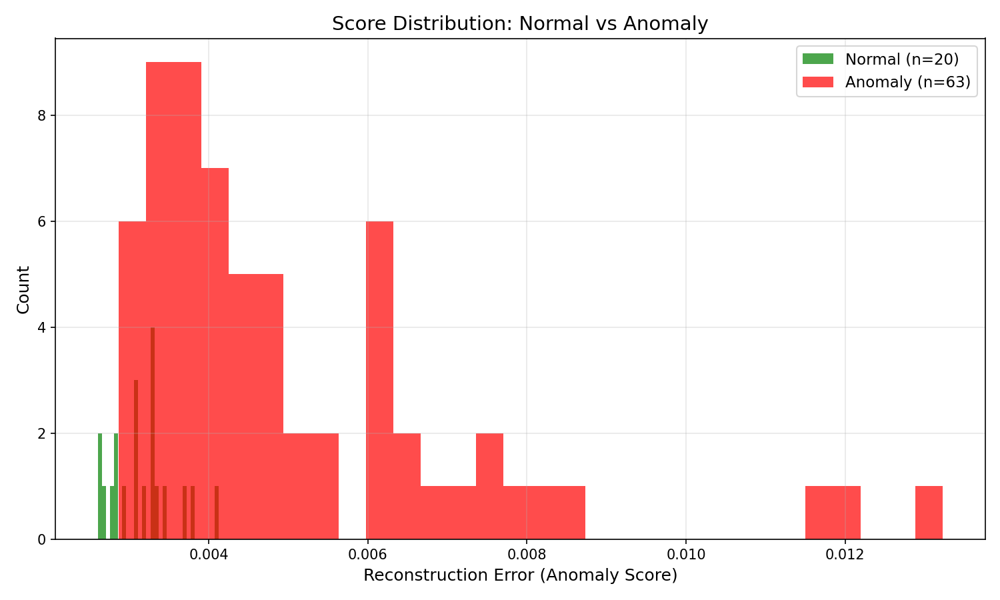

# Anomaly Detection in Industrial Images

A deep learning pipeline for detecting manufacturing defects using convolutional autoencoders. Trained on the MVTec Anomaly Detection dataset - the standard benchmark for industrial inspection research.


## Results

**AUROC: 0.8913** on MVTec AD Bottle category

| Defect Type | Samples | Mean Anomaly Score |
|-------------|---------|-------------------|
| good (normal) | 20 | 0.0032 |
| broken_large | 20 | 0.0048 |
| broken_small | 22 | 0.0054 |
| contamination | 21 | 0.0049 |

The model successfully separates normal samples from all defect types, with anomalous images scoring 1.5-1.7x higher than normal samples.




## Approach

### Core Idea
Train an autoencoder **only on normal (defect-free) images**. The model learns to reconstruct normal patterns. At test time, defects cause high reconstruction error because the model never learned to represent them.

### Architecture
- **Encoder**: 4 convolutional blocks with BatchNorm and LeakyReLU, progressively compressing 256×256×3 → 16×16×256
- **Decoder**: 4 transposed convolution blocks reconstructing back to 256×256×3
- **Total Parameters**: ~1.5M

### Training
- Loss: Mean Squared Error (MSE)
- Optimizer: Adam with learning rate scheduling
- Epochs: 50
- Hardware: Apple Silicon (MPS)

## Project Structure

```
├── models/
│   └── autoencoder.py      # Convolutional autoencoder architecture
├── utils/
│   ├── dataset.py          # MVTec dataset loader
│   ├── losses.py           # Loss functions (MSE, SSIM, Combined)
│   └── download_data.py    # Dataset download utilities
├── train.py                # Training script
├── evaluate.py             # Evaluation and visualization
└── results/                # Saved models and visualizations
```

## Installation

```bash
git clone https://github.com/YOUR_USERNAME/video-anomaly-detection.git
cd video-anomaly-detection
pip install -r requirements.txt
```

## Usage

### Download Dataset
```bash
# Download from Kaggle: https://www.kaggle.com/datasets/ipythonx/mvtec-ad
# Extract to ./data/original/
```

### Train
```bash
python train.py --category bottle --data-dir ./data/original --epochs 50
```

### Evaluate
```bash
python evaluate.py --checkpoint results/bottle_XXXXXX/best_model.pth --data-dir ./data/original
```

## Key Learnings

1. **MSE outperformed SSIM** for this task - SSIM created uniform high error across the image center, losing discriminative power
2. **Separation ratio** is a useful training metric - watching normal vs anomaly error diverge indicates learning progress
3. **Unsupervised approach** works well when anomalies are truly rare and diverse

## Dataset

[MVTec Anomaly Detection Dataset](https://www.mvtec.com/company/research/datasets/mvtec-ad) - 15 categories of industrial objects with pixel-precise defect annotations.

## References

- Bergmann et al., "MVTec AD — A Comprehensive Real-World Dataset for Unsupervised Anomaly Detection", CVPR 2019
- Bergmann et al., "The MVTec Anomaly Detection Dataset", IJCV 2021

## License

MIT